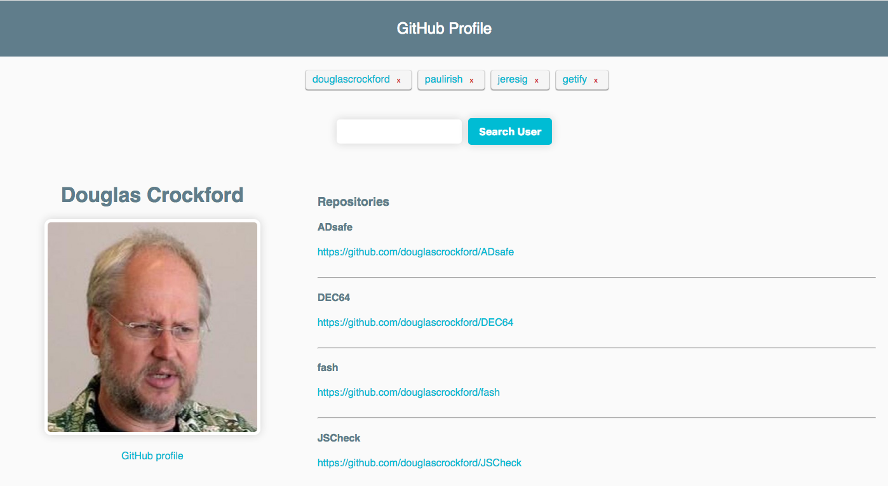

# GitHub Profile API

This project was bootstrapped with [Create React App](https://github.com/facebookincubator/create-react-app)
and deploy with [Surge](http://surge.sh/)


> This is a functional React App that loads users profiles and repositories from the GitHub API and keeps track of the search history.




## Tech/framework used

Built with:
* React (CSSTransitionGroup for Animations)
* Vanilla CSS (Flex box and media queries for Responsive Design)
* ES6 with Babel

## API Reference
* [GitHub](https://developer.github.com/v3/)

## Development Setup

```
# In the project directory, you can run:

npm start

# Runs the app in the development mode.
# Open http://localhost:3000 to view it in the browser.

# The page will reload if you make edits.
# You will also see any lint errors in the console.

npm run build

# Builds the app for production to the build folder.
# It correctly bundles React in production mode and optimizes the build for the best performance.

# The build is minified and the filenames include the hashes.
# Your app is ready to be deployed!
```

## Credits

[Pablo Jurado](http://www.pablojurado.com).
